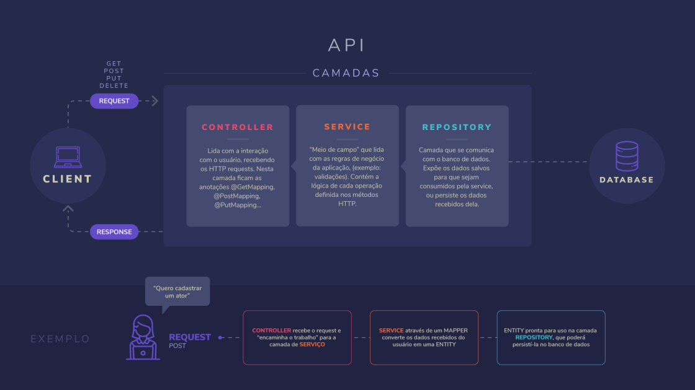

## AULA 4 - RESUMO

# Resumão da Thaís


# Controllers

São as classes responsáveis pelo mapeamento REST. 

Anotação: `@RestController`

Expõe os recursos da nossa aplicação em URLs para que possam ser:
- CONSULTADOS (@GetMapping)
- CRIADOS (@PostMapping)
- MODIFICADOS (@PutMapping)
- DELETADOS (@DeleteMapping)

Pode receber parâmetros:
- Pela URL:
```java
    @Override
    @GetMapping("/{id}")
    public ConsultarDetalhesAtorResponse getAtorById(@PathVariable("id") final Long id) {
        return atoresService.consultarDetalhesAtor(id);
    }
```
- Por Request Parameter (ex: /filmes?genero=TERROR):
```java
    @Override
    @GetMapping
    public List<FilmeResponse> getFilmes(@RequestParam(value = "genero", required = false) final Genero genero) {
        service.listarFilmes(genero);
    }
```

- Via request body:
```java
    @Override
    @PostMapping
    public Long criarFilme(@RequestBody final CriarFilmeRequest request) {
        return service.criarFilme(request);
    }
```

```java
public class CriarFilmeRequest {

    private String nome;
    private Long idDiretor;
    private List<Long> idsAtores;
    private Genero genero;
}
```

# Services

São as classes responsáveis pelas regras de negócio. 

Anotação: `@Service`

Contem a lógica por trás de cada operação definida nas Controllers.

Recebem requisições das Controllers, interagem com as repositories e retornam responses.

```java
@Service
public class AtoresService {

    @Autowired
    private AtoresRepository atoresRepository;

    static AtoresResponseMapper MAPPER_RESPONSE = new AtoresResponseMapper();
    static AtorEntityMapper MAPPER_ENTITY = new AtorEntityMapper();
    static ConsultarDetalhesAtorResponseMapper MAPPER_DETALHES_ATOR = new ConsultarDetalhesAtorResponseMapper();

    public List<AtoresResponse> getAtores() {
        final List<AtorEntity> atores = atoresRepository.getAtores();
        return MAPPER_RESPONSE.mapear(atores);
    }
}
```

# Repositories

São classes que acessam uma base de dados, consultam ela ou salvam informações nela.

Anotação: `@Repository`

Tem como objetivo expor dados salvos para que sejam consumidos pelas services, ou receber dados das services e salvá-los.

```java
@Repository
public class AtoresRepository {

    static List<AtorEntity> atores = new ArrayList<>();
    static Long contadorIds = 1l;

    public List<AtorEntity> getAtores(){
        return atores;
    }

    public Long criarAtor(final AtorEntity atorSalvar) {
        if(atorSalvar.getId() == null){
            atorSalvar.setId(contadorIds);
            contadorIds++;
        }

        atores.add(atorSalvar);

        return atorSalvar.getId();
    }
}
```

# Autowired

É a anotação que indica ao Spring que ele tem que instanciar um @RestController, @Service ou @Repository naquele atributo do nosso código. 

Tipicamente utilizado para inserir Services dentro de Controllers, e Repositories dentro de Services.

```java

@Service
public class AtoresService {

    @Autowired
    private AtoresRepository atoresRepository;

}
```

# Requests

São classes que têm como função receber dados da aplicação cliente, e repassar pras Services.

Transitam entre as Controllers e as Services, mas nunca chegam aos Repositories.

```java
public class CriarAtorRequest {

    private String nome;
    private List<Long> idFilmes;

    //construtor, getters e setters...
}
```

# Responses

São classes que têm como função, retornar dados da aplicação para seus clientes. Normalmente, as Services já retornam essas responses. Transitam entre as Services e as Controllers, mas nunca são montadas nos Repositories.

```java
public class AtoresResponse {

    private Long id;
    private String nome;
    //construtor, getters e setters...
}
```

# Entities

São as classes que têm, como função, retornar dados salvos, ou salvar dados na camada de aplicação.

Ficam restritos à camada de Repositories e seus métodos (receber uma entity e persisti-la, ou retornar Entities persistidas para a camada de Service).

```java
public class AtorEntity {

    private Long id;
    private String nome;
    private List<Long> idsFilmes;
    //construtor, getters e setters...
}
```

```java
@Repository
public class AtoresRepository {

    static List<AtorEntity> atores = new ArrayList<>();
    static Long contadorIds = 1l;

    public List<AtorEntity> getAtores(){
        return atores;
    }

    public AtorEntity criarAtor(final AtorEntity atorSalvar) {
        if(atorSalvar.getId() == null){
            atorSalvar.setId(contadorIds);
            contadorIds++;
        }

        atores.add(atorSalvar);

        return atorSalvar;
    }
}
```

# Mapper

São classes que têm como propósito, receber parâmetros e transformá-los em um determinado retorno.

Exemplos:
CriarAtorRequest -> AtorEntity
```java
public class AtorEntityMapper {
    public AtorEntity mapear(final CriarAtorRequest request) {
        return new AtorEntity(request.getNome(), request.getIdFilmes());
    }
}
```

List< AtorEntity > -> List< AtorResponse >
```java
public class AtoresResponseMapper {

    public List<AtoresResponse> mapear(final List<AtorEntity> atores) {
        List<AtoresResponse> atoresResponses = new ArrayList<>();

        for(AtorEntity atorEntity : atores){

            AtoresResponse atorResponse = new AtoresResponse(atorEntity.getId(),
                atorEntity.getNome());

            atoresResponses.add(atorResponse);
        }

        return atoresResponses;
    }
}
```


AtorEntity + List< FilmeEntity> -> ConsultarDetalhesAtorResponse
```java
public class ConsultarDetalhesAtorResponseMapper {

    public ConsultarDetalhesAtorResponse mapear(final AtorEntity atorSalvo, final List<FilmeEntity> filmesAtor) {
        List<FilmeResponse> filmesResponse = new FilmeResponseMapper().mapear(filmesAtor);
        return new ConsultarDetalhesAtorResponse(atorSalvo.getId(),
            atorSalvo.getNome(), filmesResponse);
    }
}
```
